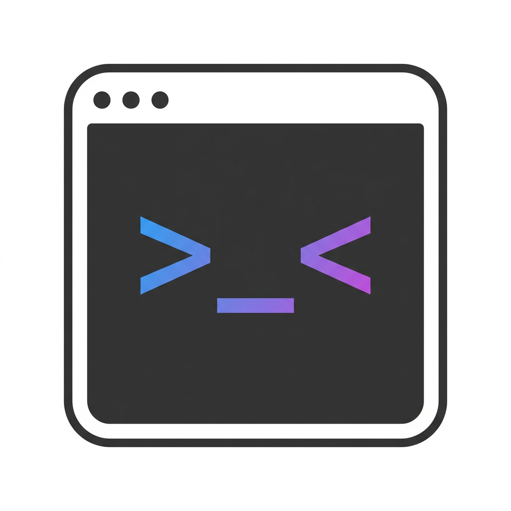

# AgentTerms

<p align="center">
  
</p>

<p align="center">
  <strong>The command center for AI-native developers.</strong><br>
  Manage multiple AI coding agents in one place — built entirely by AI, for humans who ship with AI.
</p>

<p align="center">
  
  
  
  
</p>

---

## Philosophy

> In 2026, the best developers don't write code alone — they orchestrate AI agents.

AgentTerms is designed around one belief: **your attention is the bottleneck, not your typing speed.**

When you're running 5 AI agents across 3 branches, the real problem isn't "how do I code faster" — it's:

- Which agent just finished and needs my decision?
- Which one is stuck waiting for input I forgot about?
- Where the hell is that terminal I was using 20 minutes ago?

AgentTerms gives you **ambient awareness** of all your AI agents without context-switching. One glance, you know what's happening everywhere.

### Design Principles

- **Passive observation** — We read session files. We never inject into your agent processes. Zero interference.
- **Workspace as context** — Every repo gets a workspace. Every feature branch gets a snapshot. Every tool gets a terminal. Clean isolation.
- **Status over logs** — You don't need to read 500 lines of output. You need to know: running, idle, or needs me. Three states, one glance.
- **Tool agnostic** — Claude Code, CodeBuddy, Codex, Gemini, or your custom shell script. If it runs in a terminal, we manage it.

---

## Features

| Category | What you get |
|----------|-------------|
| **Multi-agent** | Run Claude Code + CodeBuddy + Shell side by side, switch with ⌘1-9 |
| **Real-time status** | 🏃 Running / 🙋 Needs Input / 😴 Idle — detected passively from session files |
| **Workspace isolation** | Git worktrees per feature branch, fully isolated snapshots |
| **Session resume** | Close and reopen — conversations pick up exactly where you left off |
| **Terminal theming** | 8 built-in themes + custom font/size with live preview |
| **Branch management** | See and switch your base branch without leaving the app |
| **Drag reorder** | Arrange agent tabs however you think |
| **Notifications** | macOS alerts when an agent raises its hand 🙋 |
| **VS Code integration** | One click to open the working directory |
| **3D Switcher** | Mission Control-style snapshot switching |

## Status Detection

AgentTerms watches AI tool session files — never touches your agent processes:

```
┌─────────────────────────────────────────────────┐
│  JSONL session file (written by AI tool)        │
│  ~/.claude/projects/.../session.jsonl           │
└──────────────────────┬──────────────────────────┘
                       │ poll every 2s (read-only)
                       ▼
┌─────────────────────────────────────────────────┐
│  StatusMonitor → parse last message → status    │
│  tool_use detected? → 🏃 running               │
│  AskUserQuestion? → 🙋 needs input             │
│  file stale > 5s? → 😴 idle                    │
└─────────────────────────────────────────────────┘
```

## Supported Tools

| Tool | Command | Resume | Status Detection |
|------|---------|--------|-----------------|
| Claude Code | `claude` | `--resume {id}` | ✅ Full |
| CodeBuddy | `codebuddy` | `--resume={id}` | ✅ Full |
| Codex | `codex` | `resume` | 🚧 Planned |
| Gemini | `gemini` | — | 🚧 Planned |
| Shell | any command | — | — |

## Quick Start

```bash
# Clone
git clone https://github.com/lndyzwdxhs/AgentTerms.git
cd AgentTerms

# Build & Run
make run

# Or just build
make build

# Package for distribution
make dmg
```

**Requirements:** macOS 14.0+ / Swift 5.9+ / Command Line Tools for Xcode

## Configuration

All settings live in `~/.agentterms/`:

```
~/.agentterms/
├── config.json      # Workspaces, snapshots, agents, sessions
└── settings.json    # Tool commands, theme, font, language
```

## Architecture

```
Sources/
├── AgentTermsApp.swift              # Entry point
├── Models/                          # Data layer
│   ├── AppState.swift               # Single source of truth (@Observable)
│   ├── Agent.swift / Snapshot.swift / Workspace.swift
│   └── Settings.swift               # Persisted preferences
├── Services/                        # Business logic
│   ├── StatusMonitor.swift          # JSONL polling (Claude Code + CodeBuddy)
│   ├── TerminalManager.swift        # Terminal lifecycle + session detection
│   ├── GitService.swift             # Worktree & branch operations
│   └── PersistenceService.swift     # JSON read/write
├── Views/                           # UI layer (SwiftUI + AppKit bridge)
└── Utilities/                       # Theme, localization, keyboard shortcuts
```

## AI-Native Development

This entire project is built by AI coding agents. The codebase is designed to be **AI-friendly**:

- `CLAUDE.md` contains full project context — any AI agent can pick up development immediately
- Conventional commits for clear history
- Simple `make` commands — no complex build toolchain
- Single-file architecture docs — no scattered documentation to desync

See [CLAUDE.md](CLAUDE.md) for the complete AI development guide.

## License

[MIT](LICENSE) — Use it, fork it, ship it.
